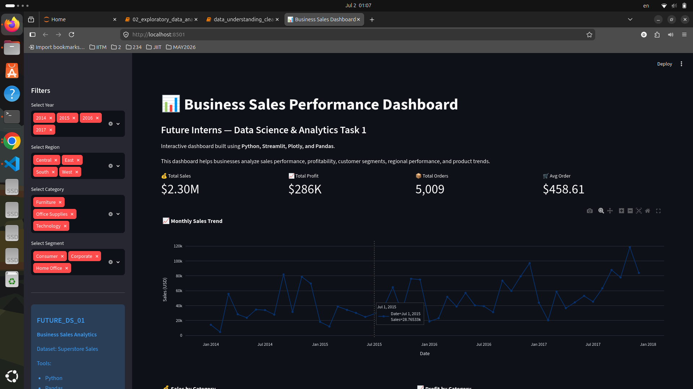
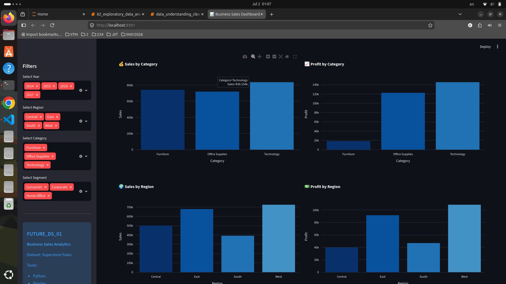
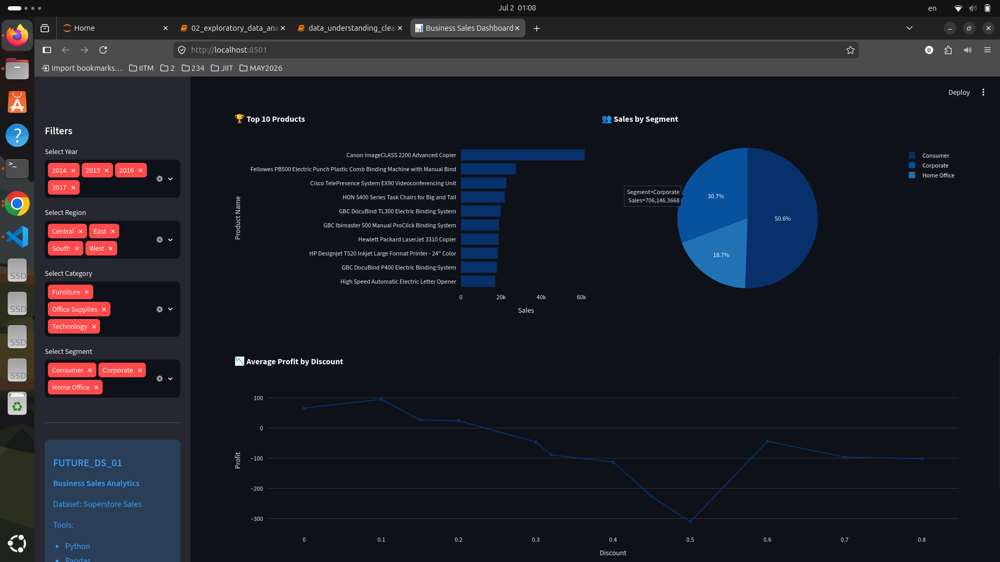
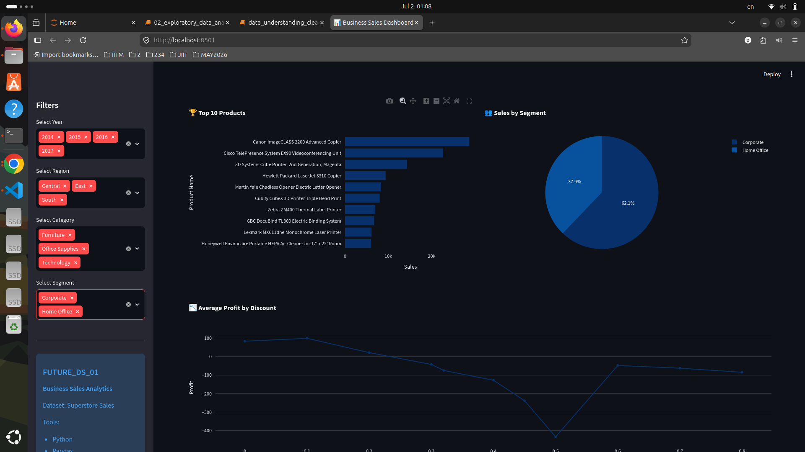

# 📊 Business Sales Performance Dashboard

## Future Interns – Data Science & Analytics Task 1

An end-to-end Business Sales Analytics project built using Python, Pandas, Plotly, and Streamlit. The project analyzes Superstore sales data to uncover business insights and presents them through an interactive dashboard.

---

## 🚀 Features

- Data Cleaning & Preprocessing
- Exploratory Data Analysis (EDA)
- Interactive Streamlit Dashboard
- KPI Cards
- Monthly Sales Trend
- Sales & Profit Analysis
- Region-wise Performance
- Category-wise Analysis
- Customer Segment Analysis
- Top 10 Products
- Discount vs Profit Analysis
- Dynamic Filters

---

## 🛠 Tech Stack

- Python
- Pandas
- NumPy
- Plotly
- Streamlit
- Jupyter Notebook

---

## 📂 Project Structure

```
FUTURE_DS_01/
│
├── app.py
├── README.md
├── requirements.txt
├── .gitignore
│
├── data/
│   └── Sample - Superstore.csv
│
├── processed_data/
│   ├── Superstore_Cleaned.csv
│   └── Superstore_Final.csv
│
├── notebooks/
│   ├── 01_data_understanding_and_cleaning.ipynb
│   └── 02_exploratory_data_analysis.ipynb
│
├── images/
│
└── dashboard_screenshots/
```

---

## ▶️ Running the Dashboard

Clone the repository

```bash
git clone https://github.com/rarethareja/FUTURE_DS_01.git
```

Move into the project

```bash
cd FUTURE_DS_01
```

Install dependencies

```bash
pip install -r requirements.txt
```

Launch the dashboard

```bash
streamlit run app.py
```

The dashboard will open in your browser at:

```
http://localhost:8501
```

---

# 📸 Dashboard Preview

## Dashboard Overview



## Sales & Profit Analysis



## Product & Segment Analysis



## Interactive Filters



---

# 📈 Key Business Insights

- 📈 Sales increased steadily throughout the analysis period.
- 💰 Technology generated the highest revenue and profit.
- 🌍 Regional performance varied significantly.
- 👥 Consumer customers contributed the largest share of sales.
- 🎯 Higher discounts generally reduced profitability.

---

## 📌 Future Improvements

- Deploy the dashboard online
- Add forecasting using Machine Learning
- Customer segmentation using clustering
- Sales prediction models
- Profit forecasting

---

## 👨‍💻 Author

**Durlabh Thareja**

GitHub: https://github.com/rarethareja
